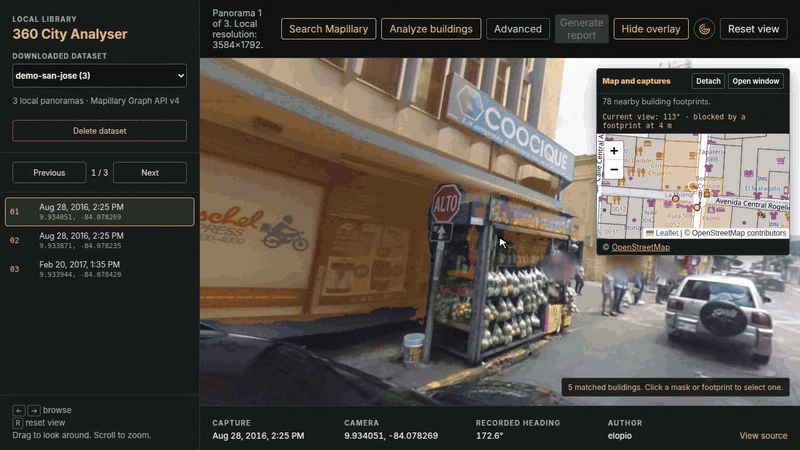

# 360 City Analyser

Local-first tools to download Mapillary 360 panoramas, view them, segment visible buildings, and associate facade evidence with OpenStreetMap footprints.



The project is pre-production: incompatible analysis artifacts are recalculated, not migrated. See [ROADMAP.md](ROADMAP.md) for reliability gates and [ARCHITECTURE.md](ARCHITECTURE.md) for report contracts.

## Principles

- OSM is the only building-footprint source.
- Original Mapillary GPS controls visible camera positions and navigation.
- Refined poses only support image-to-footprint association.
- SfM is optional depth evidence and never replaces the displayed GPS track.
- Reports are deterministic and do not run an LLM or GEM classifier.
- The system abstains when its evidence is insufficient or ambiguous.

## Setup

Choose the PyTorch build that matches the machine:

```bash
uv sync --extra cu126   # NVIDIA GPU (CUDA 12.6 wheels)
uv sync --extra cpu     # CPU only, avoids ~3 GB of CUDA libraries
```

This installs the `city_analyser` package from `src/` and the `city-analyser-*` commands used below. Run them from the repository root: datasets (`data/`), model weights (`models/`) and `.env` are read from the working directory. [ARCHITECTURE.md](ARCHITECTURE.md) describes the layout.

Pre-download the segmentation weights into `models/` so analysis also works offline:

```bash
uv run city-analyser-models            # b0, b1, b2, b5 and the Mask2Former "high" profile
uv run city-analyser-models all        # SegFormer b0-b5 plus "high" (~1.8 GB)
uv run city-analyser-models b0 b5      # aliases or Hugging Face model IDs
```

Add a Mapillary developer token to `.env` or the shell:

```bash
MAPILLARY_ACCESS_TOKEN=MLY|...
```

Do not commit tokens or downloaded imagery.

## Download

```bash
uv run city-analyser-download \
  --center 9.9281,-84.0907 \
  --radius-m 150 \
  --max-images 25 \
  --min-spacing-m 10 \
  --output data/san-jose-pilot
```

Use `--bbox min_lon,min_lat,max_lon,max_lat` instead of `--center` when needed. `--image-size auto` selects the best available derivative.

The downloader requests panoramas at API level, limits each response to 50 MB, decodes the JPEG, requires an approximately 2:1 image, and records dimensions and SHA-256. A dataset contains `images/`, `manifest.json`, `manifest.geojson`, and `ATTRIBUTION.md`; manifest coordinates are camera locations.

## Viewer

```bash
uv run city-analyser-viewer
```

Open [http://127.0.0.1:8765/viewer/](http://127.0.0.1:8765/viewer/).

The viewer provides panorama and map navigation, Mapillary downloads, OSM footprints, deep links, background analysis, optional SfM, and building reports. Nearby navigation uses original GPS, valid headings, known sequence metadata when available, and loaded OSM obstructions.

## Analysis

Click **Analyze buildings** to process the current panorama and up to six nearby eligible captures. The pipeline:

1. Validates finite GPS/heading and an equirectangular image of at least 512x256.
2. Segments perspective views with SegFormer or Mask2Former (building / vegetation evidence). The model is chosen by `BUILDING_ANALYSIS_MODEL` (below).
3. Detects individual buildings: Grounding DINO proposes one box per visible building in six portrait views (90 degrees wide, -29 to +83 degrees of elevation) and SAM 2 outlines each box. Masks are merged across views into one instance map.
4. Loads OSM ways, multipolygon relations, holes, and building parts (disk-cached per ~110 m cell).
5. Moves a GPS fix that falls inside a footprint to the nearest street-connected open space (never a courtyard), then refines the pose against the detected buildings.
6. Projects facade walls with depth ordering and partial-edge occlusion, and names each detected building with the footprint that dominates it. When the detector merged attached facades (row houses), the building is split by panorama columns, because walls are vertical.
7. Continues labels up through building pixels no footprint claims, so low OSM heights and view limits do not cut roof lines.
8. Publishes direct facade evidence, vegetation-completed evidence, and the visual instance map.

Artifacts are written under `data/<dataset>/analysis/` (`<id>.json`, `<id>-ids.png`, `<id>-facades.png`, `<id>-instances.png`). Cache identity includes source bytes, GPS, heading, every model setting, SfM input, and mask hashes. Models remain loaded per process.

The model stages are cached separately, under `data/.stage-cache/`, keyed by the panorama bytes, the model and its downloaded revision, and the stage's own settings. Changing association code, `ANALYSIS_VERSION` or the minimum confidence therefore re-associates panoramas in seconds instead of running the models again, and a panorama shared by several datasets is segmented once.

To analyze a whole dataset from the command line, overlapping model inference with OSM association:

```bash
uv run city-analyser-analyze san-jose-pilot --report analysis-report.json
```

The report lists per-panorama model and association times, cached stages and peak memory. Panoramas whose analysis is already current are skipped unless `--force` is given.

| Variable | Purpose |
|---|---|
| `BUILDING_ANALYSIS_DEVICE=auto` | `auto`, `cpu`, `cuda`, `cuda:<n>` or `mps` for every model stage |
| `BUILDING_ANALYSIS_MODEL=auto` | Default: Mask2Former `high` on a CUDA GPU with at least 12 GB, SegFormer-B5 on a smaller GPU, SegFormer-B0 otherwise |
| `BUILDING_ANALYSIS_MODEL=balanced` | SegFormer-B5 profile; `b0`..`b5` select a SegFormer size |
| `BUILDING_ANALYSIS_MODEL=high` | Large Mapillary Mask2Former profile |
| `BUILDING_ANALYSIS_MODEL=<model-id>` | Compatible Hugging Face model |
| `BUILDING_ANALYSIS_MODEL_REVISION=<commit>` | Immutable model revision |
| `BUILDING_ANALYSIS_TILE_SIZE=384` | Semantic tile edge = model input resolution, 256-1024 (default 512 SegFormer, 384 Mask2Former) |
| `BUILDING_ANALYSIS_BATCH_SIZE=4` | Semantic tiles per forward pass, 1-12; CUDA out-of-memory halves it |
| `BUILDING_ANALYSIS_MIN_CONFIDENCE=0.30` | Semantic evidence threshold |
| `BUILDING_ANALYSIS_INSTANCES=on` | Building instance stage (`off` falls back to projection-only separation) |
| `BUILDING_ANALYSIS_INSTANCE_DETECTOR=<model-id>` | Grounding-DINO-family detector (default `IDEA-Research/grounding-dino-tiny`) |
| `BUILDING_ANALYSIS_INSTANCE_SEGMENTER=<model-id>` | SAM 2 checkpoint (default `facebook/sam2.1-hiera-small`) |
| `BUILDING_ANALYSIS_INSTANCE_VIEWS=6` | Instance views around the horizon, 4-8 |
| `BUILDING_ANALYSIS_INSTANCE_DETECTOR_SIZE=800` | Detector input short edge, 384-1024 |
| `BUILDING_ANALYSIS_INSTANCE_BATCH_SIZE` | Views per detector pass (default 1 on CPU, all on GPU) |
| `BUILDING_ANALYSIS_INSTANCE_BOX_THRESHOLD=0.30` | Detector confidence threshold (detectors are calibrated differently) |
| `BUILDING_ANALYSIS_OSM_CACHE_DIR=off` | OSM footprint snapshot directory (default `data/.osm-cache`), or `off` |
| `BUILDING_ANALYSIS_OSM_CACHE_DAYS=30` | Age after which a cached OSM cell is fetched again |
| `BUILDING_ANALYSIS_STAGE_CACHE=on` | Model-stage cache; `off` always runs the models |
| `BUILDING_ANALYSIS_STAGE_CACHE_DIR` | Model-stage cache directory (default `data/.stage-cache`); set it on a remote worker to keep the cache between requests |

The semantic tile size is the resolution the model actually runs at, so it directly trades latency for detail:

```bash
uv run city-analyser-benchmark IMAGE.jpg --model b0 --model b5 --tile-size 384 --output benchmark.json
```

This measures runtime and memory, not accuracy; use `evaluation/` for accuracy.

### Hardware

Measured on a 4-core laptop CPU (no GPU), one 2048x1024 panorama:

| Stage | Time | Peak RAM |
|---|---|---|
| SegFormer-B0 / B5 semantic (512 px / 384 px tiles) | ~5 s / ~18 s | < 2 GB |
| Instances (Grounding DINO tiny + SAM 2.1 small, 6 views) | ~95 s | ~2.5 GB |
| OSM, pose and association | ~1-2 s | < 1 GB |

**Fast CPU mode (optional, AGPL-3.0).** YOLOE with its own masks instead of Grounding DINO + SAM 2 runs the instance stage in about 6 s per panorama on the same CPU, at a small measured cost (separation F 0.799 vs 0.813, detected 0.94 vs 0.97, more leak). Ultralytics is AGPL-3.0, so it is an opt-in extra, not a dependency:

```bash
uv sync --extra cpu --extra yolo
export BUILDING_ANALYSIS_INSTANCE_DETECTOR=ultralytics:yoloe-11l-seg.pt
export BUILDING_ANALYSIS_INSTANCE_SEGMENTER=detector
export BUILDING_ANALYSIS_INSTANCE_BOX_THRESHOLD=0.10
```

The first run downloads the YOLOE weights and its MobileCLIP text encoder into `models/ultralytics/`. Measured end to end with SegFormer-B0: about 10 s per panorama warm and 1.8 GB peak RAM on the 4-core laptop CPU.

On CPU-only machines either accept the instance cost, reduce `BUILDING_ANALYSIS_INSTANCE_VIEWS`, or set `BUILDING_ANALYSIS_INSTANCES=off`, or send inference to a GPU worker (below). Run one analysis process at a time on machines with 16 GB RAM or less. GPU memory has not been measured in this repository. Weights for SegFormer-B5 plus the instance models are about 0.6 GB in half precision, so a 4 GB GPU should hold them; batches halve automatically on CUDA out-of-memory. Budget more for Mask2Former `high` (about 216 M parameters).

## SfM and multi-view

**Advanced > Build sparse depth (SfM)** runs optional heading-aware PyCOLMAP reconstruction. Depth is accepted only after GPS, pose-count, reprojection, track-length, center-spread, and multi-panorama observation checks. Invalid or stale SfM is ignored; run building analysis again after building depth.

Nearby evidence is fused by OSM ID. Captures less than 3 m apart do not count as independent confirmation, and confidence is averaged per independent view rather than per pixel.

## Reports

Select a matched OSM building and click **Generate report**. Reports contain ranked evidence, input checks, limitations, and artifact hashes. Only current OSM-based reports load; JSON and HTML are not exposed by the generic `/data/` route.

Reports assess image-to-footprint association. They do not certify surveyed position, structural systems, foundations, reinforcement, code compliance, or GEM attributes.

## Remote inference (GPU box or cloud)

Start a worker with an explicit model. `--preload` loads every model before the first request, and the token is read from the environment so it stays out of process listings:

```bash
export BUILDING_ANALYSIS_REMOTE_TOKEN='use-a-long-random-secret'
BUILDING_ANALYSIS_MODEL=high uv run --extra cu126 city-analyser-worker --host 0.0.0.0 --port 8766 --preload
```

Or as a container on any NVIDIA host (local workstation or cloud GPU VM with the NVIDIA container toolkit):

```bash
docker build -f Dockerfile.worker -t 360-city-analyser-worker .
docker run --gpus all -p 8766:8766 -v "$PWD/models:/models" -v "$PWD/cache:/cache" \
  -e BUILDING_ANALYSIS_REMOTE_TOKEN -e BUILDING_ANALYSIS_MODEL=high 360-city-analyser-worker
```

`GET /api/health` reports the device and loaded models.

Start the viewer with matching model, revision, tile-size, and confidence settings:

```bash
export BUILDING_ANALYSIS_BACKEND=remote
export BUILDING_ANALYSIS_REMOTE_URL=https://gpu.example.com
export BUILDING_ANALYSIS_REMOTE_TOKEN='use-a-long-random-secret'
export BUILDING_ANALYSIS_REMOTE_TIMEOUT_S=900
export BUILDING_ANALYSIS_MODEL=high
uv run city-analyser-viewer
```

Remote mode rejects implicit `auto` models and configuration mismatches. Inference is serialized per worker. Use HTTPS outside a trusted private network.

## Demo recording

`tools/record_demo.py` re-records `docs/viewer-demo.gif` (and a `.webm`) with headless Chromium: it scripts the viewer, draws a visible cursor, and converts with an ffmpeg palette. Analyze the demo panoramas first and start the viewer with the same analysis settings, so the recording shows cached results:

```bash
BUILDING_ANALYSIS_MODEL=balanced BUILDING_ANALYSIS_TILE_SIZE=384 uv run --extra cpu city-analyser-viewer &
uv run --no-project --with playwright==1.62.0 python tools/record_demo.py --rehearse   # screenshots per step
make demo-gif
```

## Evaluation

`evaluation/` measures building separation against annotated panoramas. Annotations are SAM-assisted prompts (boxes and points per building in eight perspective views, including four upward views for roof lines) stored in `evaluation/annotations/`; a larger SAM 2 than the pipeline's turns them into masks. Expensive model outputs are cached under `data/.eval-cache/`.

```bash
uv run python -m evaluation.run semantic --variant b5-384 --model b5 --tile-size 384
uv run python -m evaluation.run instances --variant gdino-tiny
uv run python -m evaluation.run associate --semantic b5-384 --instances gdino-tiny --tag current --overlays
uv run python -m evaluation.run score --tag current            # OSM labels
uv run python -m evaluation.run score --tag current --visual   # OSM label x visual instance
```

Scores: completeness (a building under one label), purity (a label on one building), their F-score, detection, `top_detected` (upper quarter of each facade labeled), leak (labels outside buildings), and merge/split counts.

## Verification

```bash
make test
```

This runs the Python and JavaScript test suites and a syntax check of every Python module and viewer script. Run `uv run python -m unittest discover -s tests -v` for verbose test output.

## Limits

- Cross-city accuracy has not passed a labeled benchmark.
- Building parts still need a final parent-building identity policy.
- Pitch, roll, terrain, roofs, and confidence are not fully calibrated.
- SfM does not yet enforce a rigid panorama rig during optimization.
- LightGlue, Depth Anything, MoGe-2, and VGGT are candidates, not dependencies.
- The separation benchmark has 8 annotated panoramas (52 buildings, 3 cities): enough to compare variants, not to certify accuracy.
- Open-vocabulary detectors treat a block of attached facades as one building; separation inside it relies on the projected footprints and therefore on the pose.

The prioritized work, metrics, and model-adoption rules are in [ROADMAP.md](ROADMAP.md).

## License and privacy

The code in this repository is licensed under the [European Union Public Licence v. 1.2](LICENSE) (EUPL-1.2). The license covers the code only: downloaded imagery, OpenStreetMap data and third-party model weights keep their own terms, described below.

Model weights have their own licenses: SegFormer checkpoints (NVIDIA Source Code License) are for non-commercial research and evaluation only, and the Mapillary Vistas Mask2Former checkpoint is trained on a research-licensed dataset. Grounding DINO, MM-Grounding-DINO, LLMDet, SAM 2 and Depth Anything V2 Small are Apache-2.0; EoMT is MIT. The optional Ultralytics YOLOE/YOLO-World detectors are AGPL-3.0 (commercial use needs an Ultralytics license). Check these before any commercial use.

Mapillary documents ordinary imagery under CC BY-SA 4.0, subject to current platform terms and image-specific restrictions. Preserve `ATTRIBUTION.md`, do not reverse face or plate blurring, and verify current [API documentation](https://www.mapillary.com/developer/api-documentation/), [image license](https://help.mapillary.com/hc/en-us/articles/115001770409-CC-BY-SA-license-for-open-data), and [terms](https://www.mapillary.com/terms) before redistribution.
